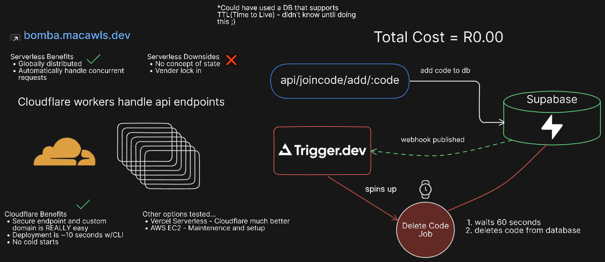

<div align="center">
  
  <a href=""></a>

  
<h1 align="center">Bomba API</h1>

<br>
<h3>An API to prevent players from joining empty relay instances</h3>

</div>
<hr>

## Technologies

* Web Framework - **[Hono](https://hono.dev/)**
* Deployment - **[Cloudflare Workers](https://developers.cloudflare.com/workers/)**
* Database - **[Supabase](https://supabase.com/)**
* Jobs - **[Trigger.Dev](https://trigger.dev/)**


## Purpose

Circumvent the issue of a **Unity Relay Allocation** not shutting down shortly after a host player disconnects. This only applies to using **websockets(wss)** for transport.

## Problem

The use of Unity's Lobby Service is unnecessary for my game's requirements.

Currently, with how relay works with **wss**, client players can join an **empty relay instance**. After a duration (usually around 1 minute) they the relay instance will shutdown and clients will be disconnected.


## How does it work?





Join codes are deleted after a specified duration set in the ```wrangler.toml```.

### Auth

The API will only work with an authentication key of which only I have access to.

## Running Locally

Start the wrangler dev server

```
npm run dev
```
In a **separate** terminal, run the trigger.dev client

```
npm run trigger-client
```
